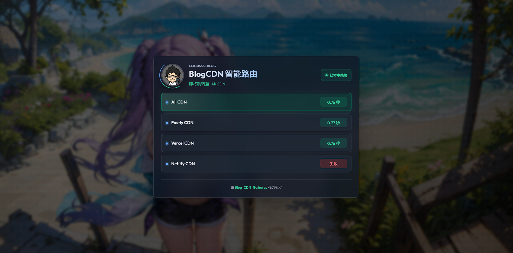

# **BlogCDN智能访问网关** Blog-CDN-Gateway

一个适合部署到 Cloudflare Snippets 的轻量级 CDN 智能路由页。  
访问网关时，页面会在浏览器端并发检测多条 CDN 线路，命中第一个返回 `HTTP 200` 的线路后，等待配置的毫秒数并跳转过去，同时保留原始路径和查询参数。

## 特性

- 适配 Cloudflare Snippets，无需环境变量。
- 所有配置集中在 `Snippets.js` 顶部的 `CONFIG`。
- 并发检测多条线路，首个返回 `HTTP 200` 的线路立即命中。
- 跳转前等待时间可配置。
- 保留访问路径和查询参数。
- 支持 `/ads.txt` 和 `/favicon.ico`。
- 支持系统日间/夜间模式自适应。
- `CONFIG.IMG` 留空时自动使用内置默认背景。
- 移动端高度足够时居中显示，高度不足时自动靠上。
- 页面只显示线路名称，不显示真实 URL。

## 工作逻辑

假设用户访问：

```text
https://gateway.example.com/posts/hello?from=home
```

前端会并发请求 `CONFIG.URLS` 中配置的线路。第一个返回 `HTTP 200` 的线路会被选中，例如：

```text
https://fastly.blog.example.com#Fastly CDN
```

等待 `CONFIG.JUMP_DELAY` 毫秒后跳转到：

```text
https://fastly.blog.example.com/posts/hello?from=home
```

这是浏览器端检测后的前端跳转，不是服务端 `302`。

## 部署方式

1. 打开 Cloudflare Dashboard。
2. 进入对应域名的 Snippets。
3. 新建 Snippet。
4. 将 `Snippets.js` 的完整内容粘贴进去。
5. 按需修改顶部 `CONFIG`。
6. 保存并启用 Snippet。

## 配置说明

配置都在 `Snippets.js` 顶部：

```js
const CONFIG = {
	URLS: [
		'https://blog.cmliussss.com#Ali CDN',
		'https://fastly.blog.cmliussss.com#Fastly CDN'
	],
	ADS: 'google.com, pub-9350003957494520, DIRECT, f08c47fec0942fa0',
	ICO: 'https://raw.cmliussss.com/favicon.ico',
	PNG: 'https://raw.cmliussss.com/IMG_0038.png',
	IMG: [],
	JUMP_DELAY: 999,
	BEIAN: `由 <a href="https://github.com/cmliu/Blog-CDN-Gateway" target="_blank" rel="noopener noreferrer">Blog-CDN-Gateway</a> 强力驱动`,
	TITLE: 'BlogCDN 智能路由',
	NAME: 'CMLiussss Blog'
};
```

| 字段 | 说明 |
| --- | --- |
| `URLS` | CDN 线路列表，格式为 `地址#显示名称`。页面只展示 `#` 后的名称。 |
| `ADS` | 访问 `/ads.txt` 时返回的文本内容。 |
| `ICO` | 网站图标地址，同时用于响应 `/favicon.ico`。 |
| `PNG` | 页面中间展示的头像或 Logo。 |
| `IMG` | 背景图片列表。多张会随机选一张，留空使用内置默认背景。 |
| `JUMP_DELAY` | 命中首个 `HTTP 200` 线路后等待多少毫秒再跳转。 |
| `BEIAN` | 页脚 HTML，可填写备案、统计代码或项目链接。 |
| `TITLE` | 页面主标题。 |
| `NAME` | 浏览器标题栏和页面小标题中的站点名称。 |

## URLS 写法

推荐每条线路都写显示名称：

```js
URLS: [
	'https://ali.example.com#Ali CDN',
	'https://fastly.example.com#Fastly CDN',
	'https://vercel.example.com#Vercel CDN'
]
```

如果没有写 `#显示名称`，页面会显示 `线路 1`、`线路 2` 这类兜底名称。

## 注意事项

- 当前需要读取真实 `response.status === 200`，目标线路必须允许浏览器跨域请求 `HEAD`，否则会显示为失败。
- 真实线路 URL 虽然不会显示在页面上，但仍会存在于前端脚本中用于测速和跳转。
- 非 `200` 响应不会被命中，页面会显示 `HTTP 状态码`。
- 所有线路都失败时，页面会提示 `所有线路均未返回 200`。

## 路由行为

- `/ads.txt`：直接返回 `CONFIG.ADS`。
- `/favicon.ico`：代理返回 `CONFIG.ICO`。
- 其他路径：返回智能路由 HTML，并在浏览器端检测线路后跳转。

## 致谢

由 [cmliu/Blog-CDN-Gateway](https://github.com/cmliu/Blog-CDN-Gateway) 驱动。
